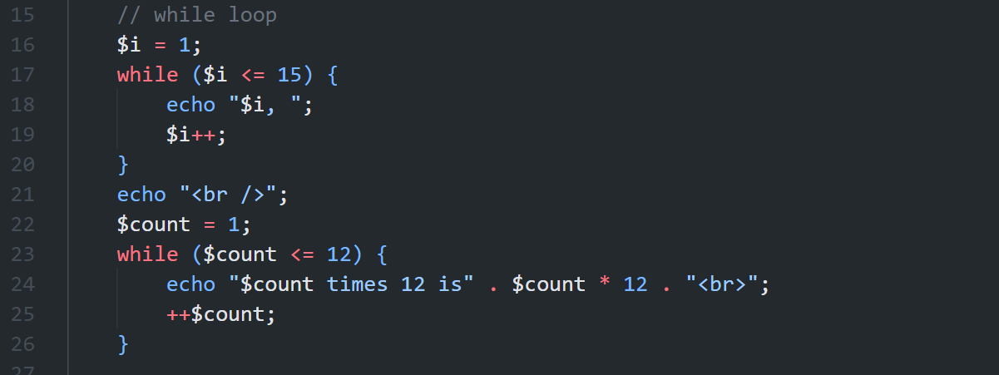
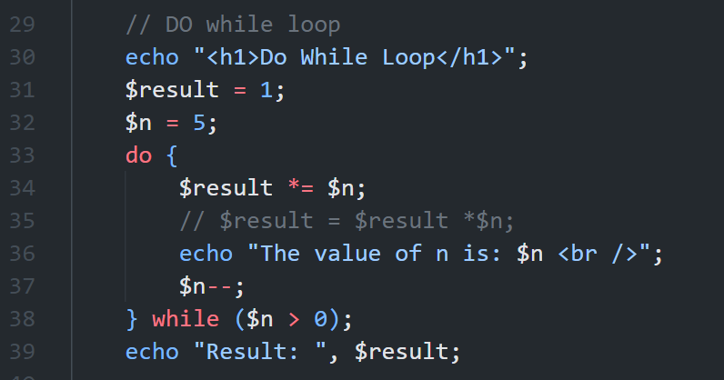
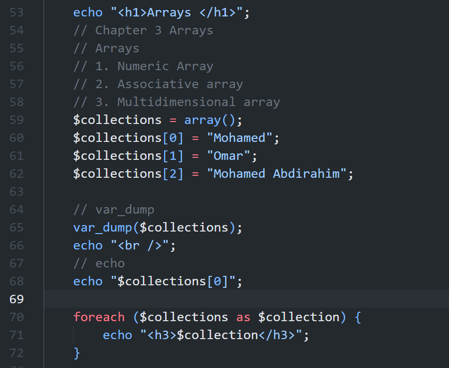
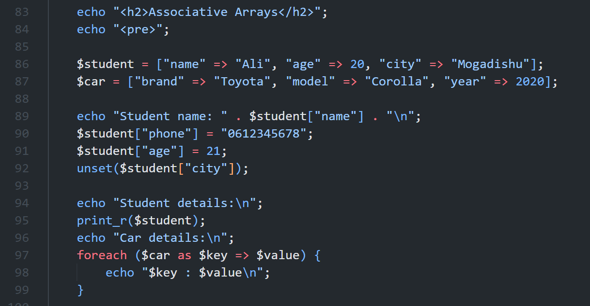
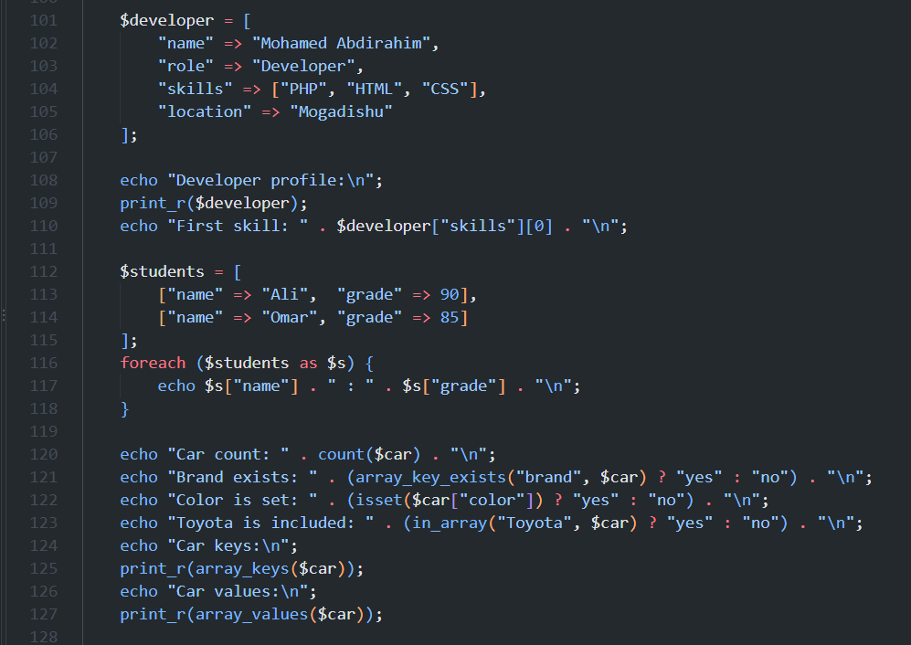

# Week 2: Loops and Arrays

This folder contains my Week 2 practice screenshots demonstrating loops and arrays in PHP from the course **Web Application Development - PHP & MySQL**.

# Week 2 Practice Screenshots

The screenshots below document the main examples in [`Week2/index.php`](../index.php).

---

# 1. While Loop and Multiplication

## Screenshot Name

`PHP_While_Loop_Practice.png`

## Description

This screenshot shows a `while` loop printing numbers from 1 to 15 and calculating multiples of 12.

### Code Example

```php
$i = 1;
while ($i <= 15) {
	echo "$i, ";
	$i++;
}
```

## Screenshot



---

# 2. Do-While and Nested Loops

## Screenshot Name

`PHP_Do_While_Nested_Loops.png`

## Description

This screenshot demonstrates a `do while` loop for calculating a factorial and nested `for` loops for multiplication output.

### Code Example

```php
$result = 1;
$n = 5;
do {
	$result *= $n;
	$n--;
} while ($n > 0);
```

## Screenshot



---

# 3. Numeric Arrays

## Screenshot Name

`PHP_Numeric_Arrays.png`

## Description

This screenshot demonstrates creating numeric arrays, accessing an element, looping through values, and displaying an array with `print_r`.

### Code Example

```php
$numbers = array(2, 3, 4, 6, 7);
foreach ($numbers as $number) {
	echo "$number <br>";
}
print_r($numbers);
```

## Screenshot



---

# 4. Associative Arrays

## Screenshot Name

`PHP_Associative_Arrays.png`

## Description

This screenshot demonstrates associative arrays, adding and updating values, removing a value, and looping through key-value pairs.

### Code Example

```php
$student = ["name" => "Ali", "age" => 20, "city" => "Mogadishu"];
$student["phone"] = "0612345678";
$student["age"] = 21;
unset($student["city"]);
print_r($student);
```

## Screenshot



---

# 5. Nested Arrays and Array Functions

## Screenshot Name

`PHP_Nested_Arrays_Functions.png`

## Description

This screenshot shows a developer profile with a nested skills array, an array of student records, and useful functions such as `count`, `array_keys`, and `array_values`.

### Code Example

```php
$developer = [
	"name" => "Mohamed Abdirahim",
	"role" => "Developer",
	"skills" => ["PHP", "HTML", "CSS"]
];

echo $developer["skills"][0];
print_r(array_keys($car));
```

## Screenshot


